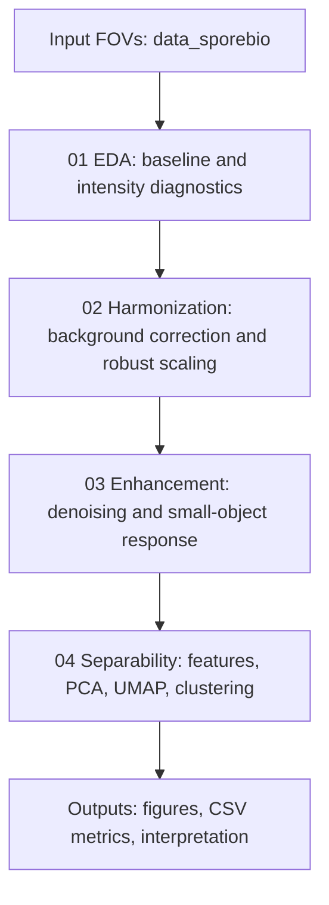

# Imaging SNR

Weak-signal imaging pipeline for exploring bacterial candidate visibility, background correction, signal enhancement, and candidate-level separability across two microscopy acquisition conditions.

This repository is organized as a reproducible analysis pipeline rather than a trained classifier. It starts from grayscale fields of view, corrects low-frequency background structure, harmonizes cross-machine intensity differences, enhances small bright responses, and evaluates whether extracted candidate features separate bacteria-like signal from particle-like interference.

Raw microscopy images are intentionally not embedded in this README. The visual sections below reference only generated aggregate metrics, feature distributions, and dimensionality-reduction plots.

## Pipeline Overview



The analysis is split into four scripts:

- `scripts/01_eda.py` summarizes raw image statistics, baseline unevenness, intensity distributions, and flattened preview diagnostics.
- `scripts/02_harmonization.py` applies object-masked background correction and robust intensity anchor matching so images from different machines can be compared on a shared scale.
- `scripts/03_signal_enhancement_denoising.py` performs edge-preserving denoising, small bright response enhancement, candidate masking, and per-candidate feature extraction.
- `scripts/04_separability_evaluation.py` evaluates candidate-level separability with interpretable features, PCA, UMAP, and unsupervised clustering diagnostics.

## Repository Layout

```text
.
|-- README.md
|-- LICENSE
|-- scripts/
|   |-- common.py
|   |-- 01_eda.py
|   |-- 02_harmonization.py
|   |-- 03_signal_enhancement_denoising.py
|   `-- 04_separability_evaluation.py
|-- data_sporebio/                 # local input data, not committed
|   |-- Bacteria/
|   `-- Particles/
`-- outputs/                       # generated analysis artifacts, not committed
```

## Data Assumptions

The expected input is a small two-group image set:

- `data_sporebio/Bacteria/*.jpg`: target weak-signal fields of view from Machine 1.
- `data_sporebio/Particles/*.jpg`: particle or interference fields of view from Machine 2.

The pipeline treats these group labels as analysis labels for feature comparison. It does not assume pixel-level annotations or validated object identities.

## Setup

Create an environment with the scientific Python packages used by the scripts:

```bash
python -m pip install numpy scipy scikit-image tifffile matplotlib seaborn pandas scikit-learn umap-learn python-igraph leidenalg
```

The repository also includes a dev container configuration under `.devcontainer/`. The Dockerfile expects a `requirements.txt` during image build, so install dependencies manually or add a matching requirements file before building the container.

## Run The Pipeline

Run scripts from the repository root so `data_sporebio/` and `outputs/` resolve correctly:

```bash
python scripts/01_eda.py
python scripts/02_harmonization.py
python scripts/03_signal_enhancement_denoising.py
python scripts/04_separability_evaluation.py
```

Each stage writes into its own directory under `outputs/`. The later stages recompute the preprocessing they need, but running the scripts in order gives the clearest audit trail.

## Generated Outputs

```text
outputs/
|-- 01_eda/
|   |-- eda_image_statistics.csv
|   |-- eda_group_summary.csv
|   `-- aggregate baseline and intensity figures
|-- 02_harmonization/
|   |-- harmonization_metrics.csv
|   |-- harmonization_group_summary.csv
|   |-- harmonization_summary_metrics.png
|   `-- images/*/*_harmonized.tif
|-- 03_signal_enhancement_denoising/
|   |-- enhancement_metrics.csv
|   |-- enhancement_group_summary.csv
|   |-- candidate_features_from_enhancement.csv
|   |-- enhancement_summary_metrics.png
|   `-- images/*/*_{harmonized,denoised,enhanced,candidate_mask}.tif
`-- 04_separability_evaluation/
    |-- candidate_features.csv
    |-- feature_separability_summary.csv
    |-- candidate_feature_pca.png
    |-- candidate_feature_umap.png
    |-- candidate_feature_distributions.png
    |-- umap_cluster_metrics.csv
    `-- separability_interpretation.md
```

Because `outputs/` is gitignored, these files appear after the pipeline has been run locally.

## Visual Results

The README avoids raw fields of view and per-image stage panels. The following generated figures are aggregate diagnostics that can be displayed or shared without embedding the source microscopy images.

### Harmonization Diagnostics


This figure compares raw and harmonized intensity behavior, background residual variation, and large-artifact halo reduction across the two groups.

### Enhancement Diagnostics


This figure summarizes denoising and candidate detection proxies such as noise reduction, candidate count, median signal-to-background ratio, and median contrast-to-noise ratio.

### Candidate Feature Space


PCA provides a compact linear view of candidate-level morphology and intensity features.


UMAP provides a nonlinear embedding for checking whether bacteria-labeled and particle-labeled candidates occupy different regions of feature space.

### Feature Distributions And Clustering


Feature distributions make the separability drivers easier to inspect directly, including morphology, intensity, SBR, and CNR measurements.


Cluster composition plots compare unsupervised groupings with the known image-level labels. These are diagnostic checks, not classifier performance claims.

## Method Notes

The processing stack combines conservative image-processing steps with transparent candidate-level measurements:

- Background correction uses smoothed baselines and object-masked paraboloid fitting to reduce low-frequency illumination structure.
- Harmonization maps robust low and high intensity anchors so Machine 2 particle images can be compared against the Machine 1 bacteria reference scale.
- Enhancement uses bilateral denoising and small bright response filtering to emphasize weak, compact candidates.
- Candidate features combine morphology, local background estimates, SBR, CNR, and enhanced-response measurements.
- Separability is reported through effect sizes, quantile overlap, PCA/UMAP structure, and clustering agreement metrics.

## Interpretation Boundaries

This project is designed for exploratory weak-signal analysis. The dataset is small, labels are image-level rather than pixel-level, and the extracted candidates are proxy detections. Results should be interpreted as evidence about preprocessing quality and feature separability, not as validated sensitivity, specificity, or deployment-ready classification performance.

## License

This project is distributed under the terms in `LICENSE`.
